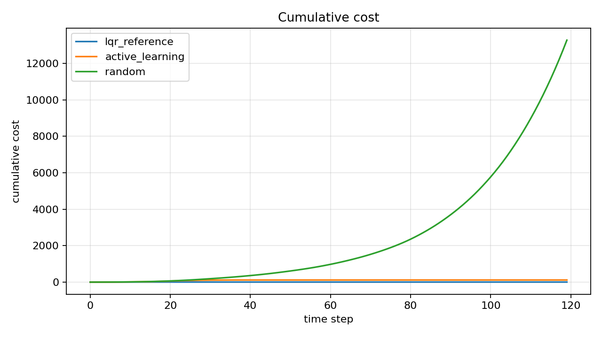
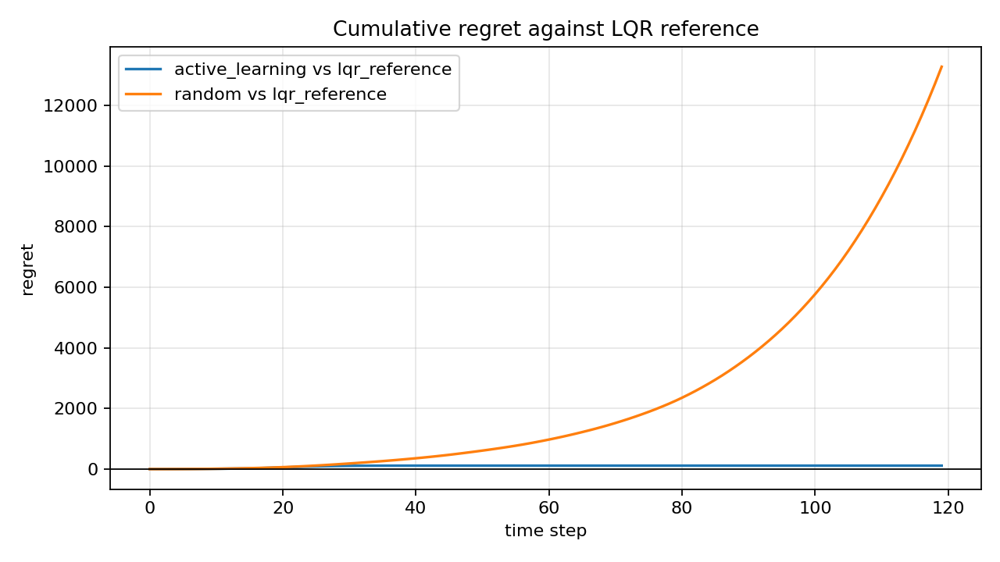

# Learning Control Mini Benchmark

A lightweight benchmark prototype for learning-based control on a linear dynamical system.

This project was built as a small personal preparation project for student research work on benchmarking learning algorithms for dynamical systems. It is intentionally compact and educational, not an official project or a complete research framework. The goal is to show the basic structure of such a benchmark:

- simulation environment with a minimal `reset()` / `step()` API
- agent interface for controllers and learning algorithms
- evaluation modules for cost, cumulative cost, and regret
- reproducible experiment runner with JSON logging and plots

The project intentionally has no external Gymnasium dependency. The environment API is Gymnasium-inspired, so the design can later be extended to Gymnasium or MuJoCo environments without making this prototype heavy.

## Benchmark Idea

The simulated system is a discrete-time linear dynamical system:

```text
x[t+1] = A x[t] + B u[t] + w[t]
```

The control objective is to keep the state and input small:

```text
cost = x.T Q x + u.T R u
```

The benchmark compares:

- `RandomAgent`: random actions as a simple baseline
- `LQRAgent`: a reference controller that knows the true system model
- `ActiveLearningAgent`: estimates the dynamics from interaction data, uses simple probing actions to collect data, and then applies a controller based on the learned model

Regret is computed as the cumulative cost gap to the reference LQR controller:

```text
regret[t] = cumulative_cost_agent[t] - cumulative_cost_lqr_reference[t]
```

## Project Structure

```text
learning-control-mini-benchmark/
  README.md
  requirements.txt
  src/
    learning_control_benchmark/
      agents.py
      environments.py
      evaluation.py
      lqr.py
      runner.py
  examples/
    run_linear_system_benchmark.py
  results/
    generated after running the example
```

## Quick Start

```bash
pip install -r requirements.txt
python examples/run_linear_system_benchmark.py
```

The script writes:

- `results/results.json`
- `results/cost_curve.png`
- `results/regret_curve.png`

Example output from one run is included in `example_outputs/`.





## Why This Is Useful

Many machine-learning benchmarks evaluate final performance on a static dataset. Dynamic systems need a different view: the algorithm interacts with the system while learning, and performance during this interaction matters. This small benchmark therefore separates environment, agent, and evaluation interfaces and includes regret as an interaction-aware metric.

The implementation is kept deliberately simple so that each part can be read without much background:

- the environment is one linear system
- the learning agent uses least-squares model estimation
- the reference agent uses a standard LQR controller
- the evaluator computes cumulative cost and regret

## Limitations and Next Steps

This is a compact educational prototype, not a full research benchmark. Natural extensions would be:

- add a true Gymnasium wrapper
- add MuJoCo environments
- add safety-constraint violations as metrics
- add more active learning query strategies
- add multiple systems and randomized benchmark suites
